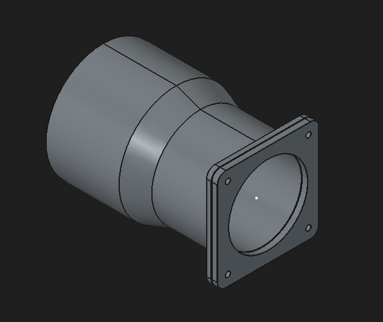
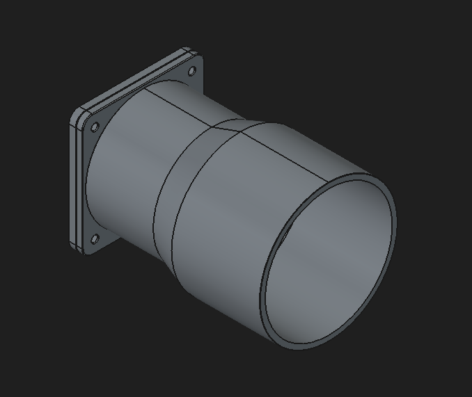
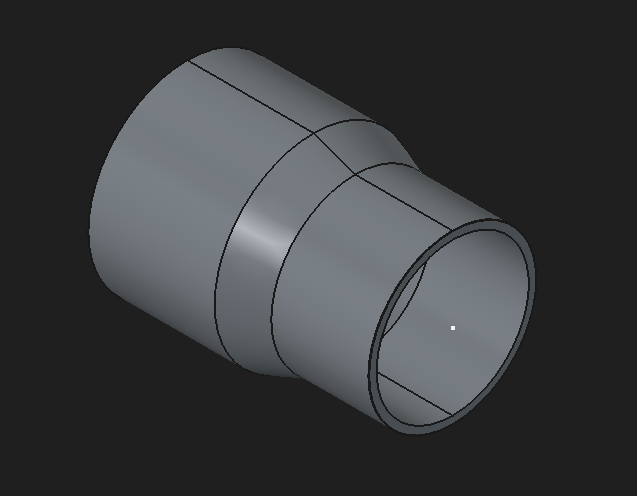
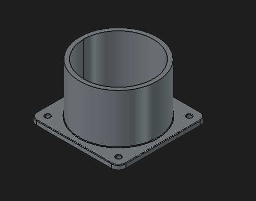
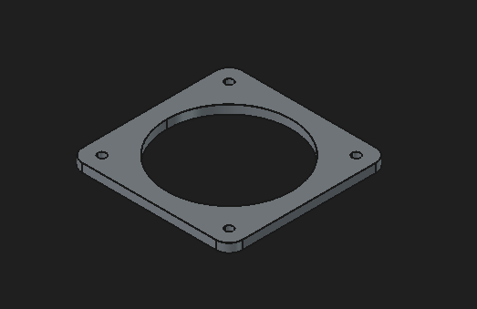
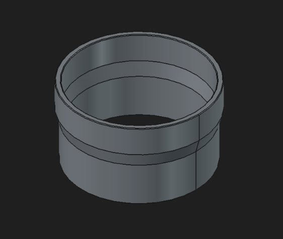

# Background

Like many others in the additive manufacturing space, I needed to print ASA due to its tensile strength and heat resistance, while being less likely to creep than Nylon. As such, I needed a way to counteract the carcinogenic fumes that come with melting styrene. 

I did some research and found a few solutions to reduce exposure. I found that most people typically place their 3D printers in an area where people do not spend extended periods of time at, such as a garage, and leave it there without filtering the fumes. This may work, however, exposure is still possible if a person walks through the area or if a person goes to collect a print, or to view the 3D printer. This led me to decide that I needed to vent the fumes out of a nearby window, so that exposure would be further limited. 

The most popular way I saw people venting 3D printers outside of windows was with a hose hooked up directly to an enclosed 3D printer. This comes with two flaws. 

1) An enclosed printer that has a hose pulling out air from the back will not be able to retain as much heat. This is critical, as a warmer chamber has the ability to make parts stronger when needed, as well as preventing warping due to rapid cooling.
2) Unenclosed printers are not able to use this as a viable solution. An air duct placed closely may help, however, it still has the chance of leaking significantly. 

In my situation, I have an enclosed printer, however, I still want to be able to retain heat. I found that the best way of handling ventilation would be to place the 3D printer in a generic printer enclosure, or a grow tent. This way, you can still retain heat within an enclosed 3D printer because you are not pulling air directly from the 3D printer's enclosure, but rather, from the air around the 3D printer. 

It is worth noting that many of these 3D printer enclosures on Amazon may have an optional ventilation kit, however, these typically come with very slow and weak fans. I found such a kit for $30, (made by the same company that makes the enclosure) however, it uses a 5v fan that is weak and unreliable. My solution features a 19V 4 inch duct fan, which is advertised as 130CFM, and blows significantly stronger. This 4 inch ventilation system should cost around $55 total, and that includes a window duct, whereas the aforementioned 5v kit does not have a window mounting kit. 

# BOM
- https://a.co/d/02iGGDAp | YOOPAI 3D Printer enclosure. AD5X variant, however, other variants may be compatible if mounting holes are similar. Other enclosures are untested, however, V2 of the venting system will have more compatibility. 
- https://a.co/d/0iFuqe73 | Dryer Window Ventilation Kit. You can use whatever brand you want here, however, it has to be suitable for a 4 inch hose.
- https://a.co/d/06P8NEus | VIVOSUN 4" Inline Exhaust Fan. You can use any fan you want as long as dimensions are the same. 
- 4 M4x6 Screws
- 4 M4 Nuts
- ~200g of filament. I used PETG, however, most filaments should be fine. 

# Assembly

There are two pieces that mount to the tent. One of them is a flat piece that goes inside the tent, the other piece is similar, however, has a cylindrical hole that sticks out, which goes on the outside. These two pieces are held together by 4 M4 screws (any length, however 6mm works.) and 4 M4 Nuts. From there, you can fit the piece that slides onto the outside mount and make sure that it fits properly. If printed properly, it should be able to hold on by friction alone easily, while still being very easy to remove. To attach the hose to this, all you need to do is wrap the hose around the bigger end.

# To Do

- ~~There is one more piece that I need to make. It needs to connect the hose to the fan part, but I was in a rush to get this done so I used HVAC tape. V2 of this system will have that.~~ Piece has been made! Just slide it on. You can use HVAC tape if you need to secure it (Although pretty much any tape will work.)

# Bonus

- Voron 0.2 tophat panel will be uploaded soon, so that you can extract fumes straight from that enclosure. As mentioned previously, you lose a ton of chamber heat from this, however, in my personal application I end up printing PLA/PETG/PET more often than ASA on my Voron so this is fine for me. 

# Images

## Assembly

## TentToHose

## OuterTentPiece

## InsideTentMount

## HoseToFan

